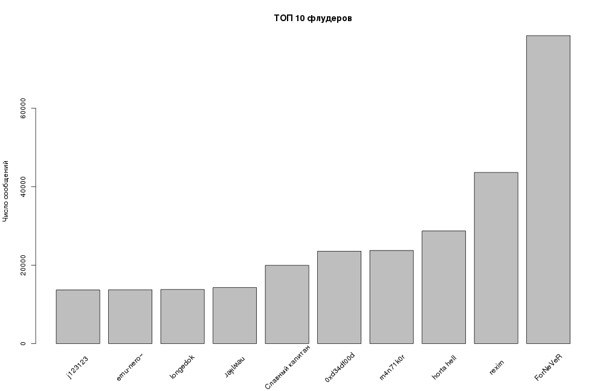
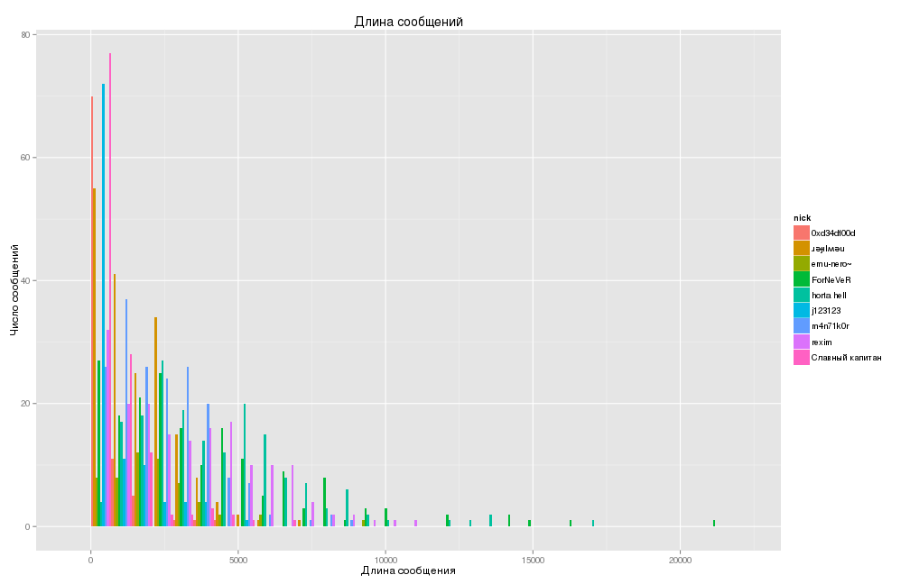
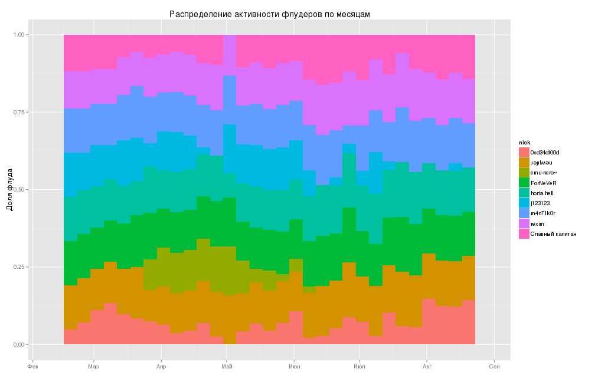

# Анализ логов чата #


```r
# Глобальные настройки
setwd("~/Projects/R/horta-logs/")
options(warn=-1) # мой код совершенен!
```


```r
# Загрузка и кэширвание данных
data <- read.delim("./logs/codingteam@conference.jabber.ru/out", header=F, sep="`", 
                     quote="", as.is=T)
clear_data <- data[data[,3] != "",]
colnames(clear_data) <- c("date", "nick", "message")
clear_data["fnicks"] <- as.factor(clear_data[,2])
clear_data["pdates"] <- as.Date(clear_data[,1], "%Y-%m-%d")
clear_data_dates <- clear_data[!is.na(clear_data$pdates),]
```


```r
p <- barplot(tail(sort(table(clear_data$fnicks)), 10), main="ТОП 10 флудеров", ylab="Число сообщений", xaxt="n")
top_10_nicks <- paste(names(tail(sort(table(clear_data$fnicks)), 10)))
text(cex=1, x=p, y=-6000, top_10_nicks, xpd=TRUE, srt=45)
```

 


```r
library(ggplot2)
top10_data <- clear_data[clear_data[,2] %in% top_10_nicks,]
top10_data_dates <- clear_data_dates[clear_data_dates[,2] %in% top_10_nicks,]
top10_data_dates["len"] <- sapply(top10_data_dates$message, nchar)
top10_data_date_by_nicks <- aggregate(top10_data_dates$len, by=list(nick=top10_data_dates$nick, date=top10_data_dates$pdates), FUN=sum)
k <- ggplot(top10_data_date_by_nicks, aes(x, fill=nick)) + geom_bar(position="dodge") + ggtitle("Длина сообщений") + xlab("Длина сообщения") + ylab("Число сообщений")
suppressMessages(print(k)) # я всё ещё уверен что мой код идеален
```

 


```r
top10_data_date_by_nicks_stripped <- top10_data_date_by_nicks[2:(length(top10_data_date_by_nicks$date)-5),]
k <-ggplot(top10_data_date_by_nicks_stripped, aes(date, fill=nick)) + geom_bar(position="fill") + ggtitle("Распределение активности флудеров по месяцам") + xlab("") + ylab("Доля флуда")
suppressMessages(print(k)) # см. выше
```

 
